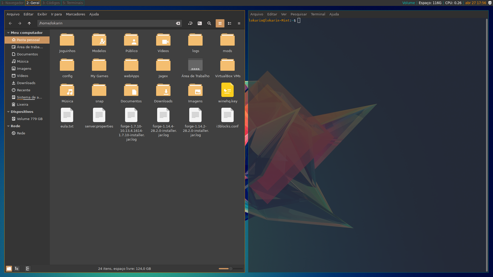

# Lokarin-s-I3-Config
Minhas configurações do I3 para o Linux Mint

- Requirements
  - i3-gaps;
  - i3lock;
  - i3blocks;
  - Compton;
  - Rofi (Theme: arthur2.rasi);
  
  - Icons: [Vimix-icon-theme](https://www.gnome-look.org/s/Gnome/p/1273372);
  - Font: [YosemiteSanFranciscoFont](https://github.com/supermarin/YosemiteSanFranciscoFont);
  - Theme: Mint-Y-Dark-Orange.
 
 
  
