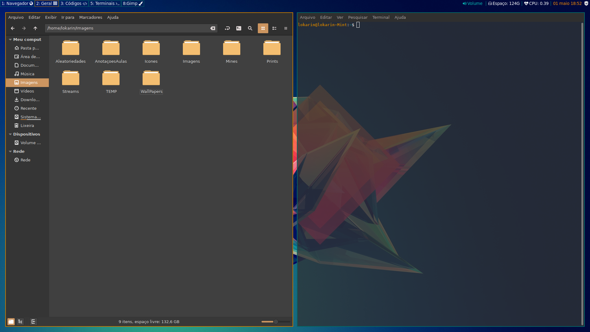
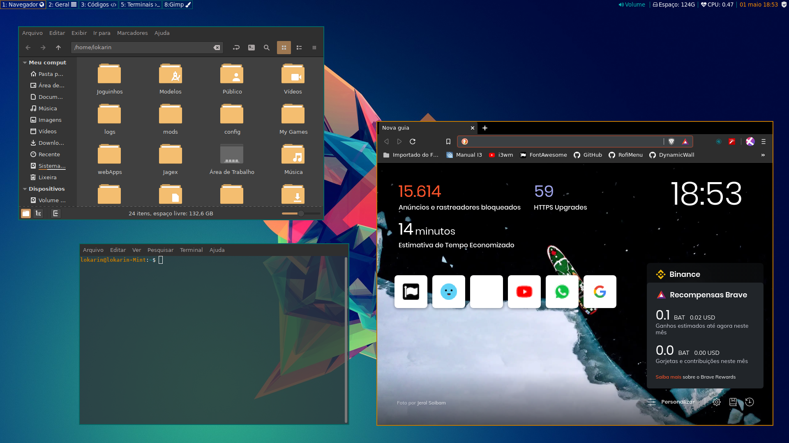

# My I3 settings for Linux Mint

# - Requirements
  - i3-gaps;
  - i3lock;
  - i3blocks;
  - pavucontrol;
  - Compton;
  - Rofi (Theme: arthur2.rasi);
  
  - Icons: [Vimix-icon-theme](https://www.gnome-look.org/s/Gnome/p/1273372);
  - Fonts: [YosemiteSanFranciscoFont](https://github.com/supermarin/YosemiteSanFranciscoFont), Font Awesome;
  - Theme: Mint-Y-Dark-Orange.
 
 
**Important:**

  **- There are some applications that are about to start with I3, make sure you have them or remove the lines in the config that start those applications.**
  
  **- The config is configured with MY paths, don't forget to change them!**
