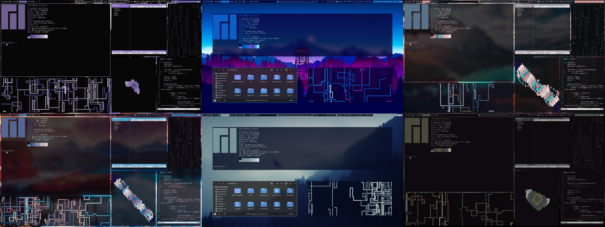
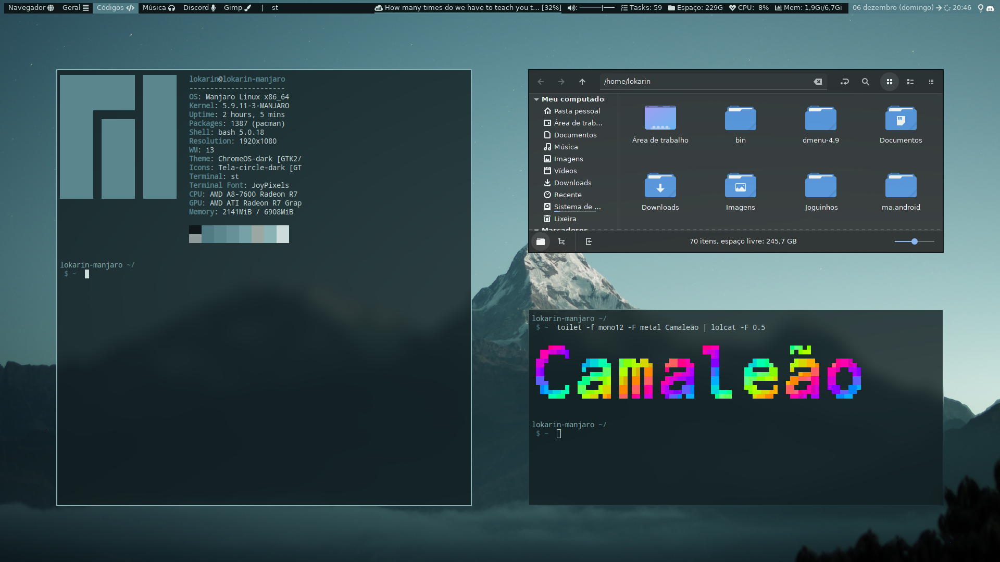

# Chameleon i3

# - Requirements
  - i3-gaps;
  - pywal;
  - picom;
  - Some of my [Scripts](https://github.com/Lokarin/myBashScripts);
  - Fonts: [YosemiteSanFranciscoFont](https://github.com/supermarin/YosemiteSanFranciscoFont), Font Awesome;
