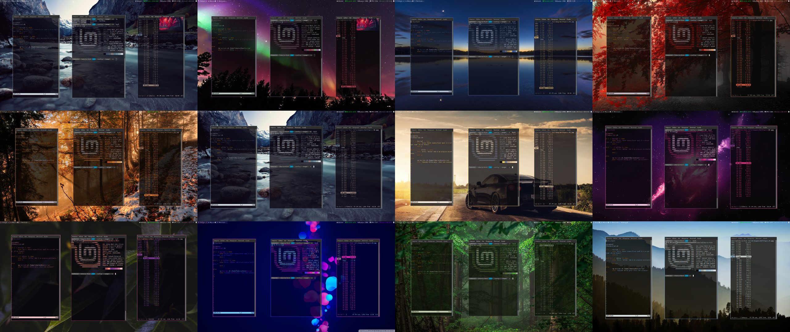
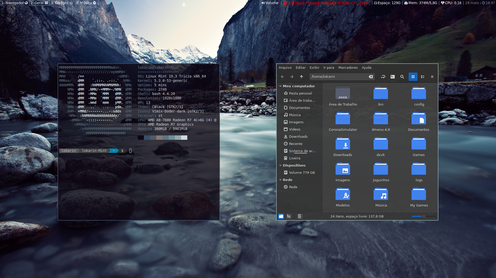

# Chameleon i3

# - Requirements
  - i3-gaps;
  - i3blocks;
  - pywal;
  - pavucontrol;
  - Compton;
  - dmenu;
  - st;
  - sxiv;
  - Rofi;
  - Some of my Scripts;
  - Fonts: [YosemiteSanFranciscoFont](https://github.com/supermarin/YosemiteSanFranciscoFont), Font Awesome;
  - Theme: CBlack; 
  - Icons: [Vimix Doder dark](https://www.gnome-look.org/content/show.php/Vimix+Dark?content=162556). 
 
**Important:**

  **- There are some applications that are about to start with I3, make sure you have them or remove the lines in the config that start those applications.**
  
  **- The config and scripts are configured with MY paths, don't forget to change them!**
